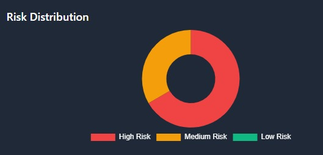
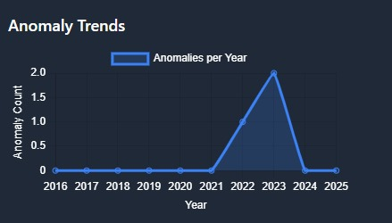
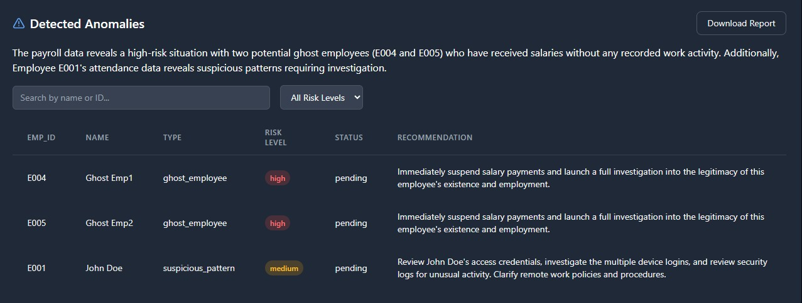

# Phantom Pay

A secure and efficient payroll management system built with Flask and Google's Generative AI.

## Project Description

Phantom Pay is an advanced payroll management system designed to streamline and secure the payroll process for businesses of all sizes. Leveraging the power of Google's Generative AI, this system provides intelligent insights and automation capabilities to make payroll management more efficient and error-free.

### Key Features
- **AI-Powered Analysis**: Utilizes Google's Generative AI to analyze payroll patterns and provide intelligent insights
- **Secure Data Management**: Implements robust security measures to protect sensitive employee and financial data
- **Automated Calculations**: Handles complex payroll calculations including taxes, deductions, and benefits automatically
- **User-Friendly Interface**: Intuitive dashboard for easy navigation and management
- **Comprehensive Reporting**: Generates detailed reports for payroll analysis and compliance
- **Multi-User Support**: Role-based access control for different levels of users (admin, HR, managers)

### Technology Stack
- **Backend**: Flask (Python web framework)
- **Database**: SQLAlchemy with Flask-SQLAlchemy
- **AI Integration**: Google Generative AI
- **Data Processing**: Pandas for efficient data manipulation
- **Frontend**: Modern web interface with responsive design

### Use Cases
- Small to medium-sized businesses looking to automate their payroll process
- HR departments seeking to reduce manual workload
- Companies requiring secure and compliant payroll management
- Organizations wanting to leverage AI for payroll insights and optimization

### System Visualizations

#### 1. Risk Distribution Analysis

Visual representation of risk distribution across different payroll parameters

#### 2. Anomaly Trends

Analysis of anomaly trends over time in payroll data

#### 3. Detected Anomalies

Detailed view of detected anomalies in the payroll system

## Prerequisites

Before you begin, ensure you have the following installed:
- Python 3.8 or higher
- pip (Python package installer)
- Git

## Installation Steps

1. Clone the repository:
```bash
git clone https://github.com/Dakshmulundkar/Phantom-pay.git
cd Phantom-pay
```

2. Create a virtual environment (recommended):
```bash
# For Windows
python -m venv venv
venv\Scripts\activate

# For macOS/Linux
python3 -m venv venv
source venv/bin/activate
```

3. Install the required dependencies:
```bash
pip install -r requirements.txt
```

4. Set up environment variables:
Create a `.env` file in the root directory and add your configuration:
```
FLASK_APP=app.py
FLASK_ENV=development
```

5. Initialize the database:
```bash
flask db init
flask db migrate
flask db upgrade
```

## Running the Application

1. Start the Flask development server:
```bash
flask run
```

2. Open your web browser and navigate to:
```
http://localhost:5000
```

## Features

- Secure payroll management
- Employee data management
- Automated calculations
- AI-powered insights
- User authentication and authorization

## Contributing

1. Fork the repository
2. Create your feature branch (`git checkout -b feature/AmazingFeature`)
3. Commit your changes (`git commit -m 'Add some AmazingFeature'`)
4. Push to the branch (`git push origin feature/AmazingFeature`)
5. Open a Pull Request

## License

This project is licensed under the MIT License - see the LICENSE file for details.

## Contact

Daksh Mulundkar - [GitHub Profile](https://github.com/Dakshmulundkar)

Project Link: [https://github.com/Dakshmulundkar/Phantom-pay.git](https://github.com/Dakshmulundkar/Phantom-pay.git) 